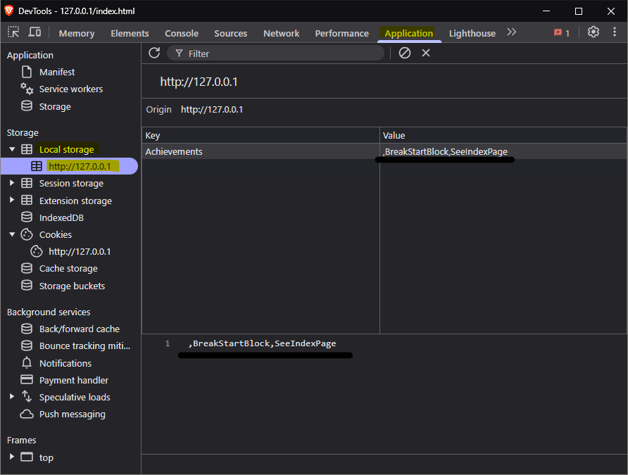
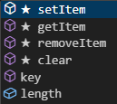

# NSI ~ MiniProjet 2 : Un site web (HTML/CSS/JavaScript)

Nous avons décider de le faire en binôme sur les personnages iconiques **Steve** et **Alex** de [__Minecraft__](https://minecraft.net/) !

# Explication du LocalStorage & Promise
## LocalStorage
Le "LocalStorage" ou le "Stockage local" est une fonctionnalitée, offerte par les navigateurs internet, qui permet de stocker des données en JavaScript pour l'utilisateur.
Ici, nous en avons eu l'utilité pour sauvegarder les données des **Succès** (Voir plus bas) et sauvegarder la progression de l'utilisateur dans le site.

### Comment voir les données du Stockage Local qui sont sauvegarder sur mon navigateur ?
Pour voir et modifier les données qui sont stockées sur votre navigateur, vous pouvez vous rendre dans le **DevTools** (Clique droit => Inspecter OU Combinaison Ctrl+Maj+I sur le navigateur)\
\
Pour y accéder, nous nous sommes diriger dans "Applications" puis "Local Storage" (La langue peut changer selon votre configuration). Vous pouvez le voir grâce aux éléments jaunis.

Nous voyons que pour le moment, nous avons débloquer 2 succès qui sont : BreakStartBlock (Destruction) et SeeIndexPage (Présentation) !
En JavaScript, pour modifier ces données, nous pouvons utiliser `localStorage` pour accéder aux méthodes disponible.\
\
Ici, nous voyons **5 méthodes** et **une propriété** :
- **setItem** : Cette méthode permet de définir la valeur d'un "item" dans le stockage local
- **getItem** : Cette méthode permet de récupérer la valeur d'un "item" dans le stockage local (attention ce dernier doit exister sinon une valeur __null__ est retournée !)
- **removeItem** : Cette méthode permet de supprimer un "item" dans le stockage local
- **clear** : Cette méthode permet de supprimer tous les "items" dans le stockage local
- **key** : Cette méthode permet de récupérer le nom de l'item selon sa position dans le stockage local (si l'"item" n'existe pas, une valeur __null__ est retournée !)
- **length** : Cette propriété permet de récupérer le nombre d'élément qu'il y a dans le stockage local

Toutes ces méthodes/propriété permettent, à leurs manière, d'intéragir avec le Stockage Local du navigateur.
Un exemple d'utilisation peut être trouvé [ici](https://github.com/tgbhy/NSI-MiniProjet2/blob/3ad4c17dca8cfec69fbbddedb0a3b5e86b3f4221/assets/js/MinecraftToast.js#L75)

## Promise
Une **Promise**, en JavaScript, permet d'exécuter des actions de manière __asynchrone__.
Ce qui veut dire que la Promise permet la continuation de l'exécution du code tant que la Promise **n'est pas résolu**.

En effet, une Promise est composée de **3 états**:
- **Pending** : Cette état permet de dire que la Promise est en attente d'une réponse ou d'un rejet
- **Fulfilled** : Cette état permet de dire que la Promise s'est terminée correctement
- **Rejected** : Cette état permet de dire que la Promise a fait face à une erreur.

Ces états permettent au développeur de faire une action selon le résultat de manière simple et compréhensible.
Les Promises peuvent aussi, comme ici, être utilisé pour avoir des files d'attente grâce au mot clé **await** qui permet d'avoir une action qui devra se terminer avant de continuer dans le code.
Voir le fichier [MinecraftToast.js](https://github.com/tgbhy/NSI-MiniProjet2/blob/main/assets/js/MinecraftToast.js) aux lignes [11](https://github.com/tgbhy/NSI-MiniProjet2/blob/main/assets/js/MinecraftToast.js#L11) et [36](https://github.com/tgbhy/NSI-MiniProjet2/blob/4ebfc9e3ddd6a1bc1b7451483a24fbc2ebf7da82/assets/js/MinecraftToast.js#L36) pour un exemple d'utilisation.